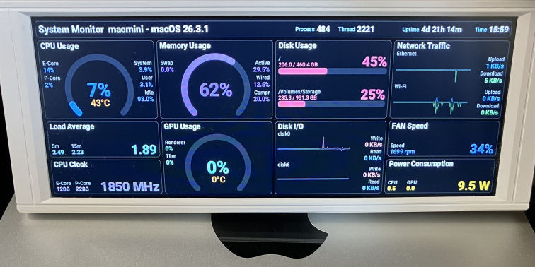

# Mac Stat Display

A macOS system monitor that displays real-time stats (CPU, memory, GPU, disk, network, etc.) on a USB LCD screen.

Uses the [Thermalright Trofeo Vision LCD](https://www.thermalright.com/product/trofeo-vision-lcd-white/) as the display device.



## ⚙️Installation

### 1. Deploy the application

Copy the published application to `/opt/stat/`:

```sh
sudo mkdir -p /opt/stat
sudo cp -R ./publish/ /opt/stat/
```

### 2. Create a launch daemon

Create `/Library/LaunchDaemons/stat.plist` with the following content:

```xml
<?xml version="1.0" encoding="UTF-8"?>
<!DOCTYPE plist PUBLIC "-//Apple//DTD PLIST 1.0//EN"
  "http://www.apple.com/DTDs/PropertyList-1.0.dtd">
<plist version="1.0">
<dict>
    <key>Label</key>
    <string>MacStatDisplay</string>
    <key>ProgramArguments</key>
    <array>
        <string>/opt/stat/MacStatDisplay</string>
    </array>
    <key>WorkingDirectory</key>
    <string>/opt/stat</string>
    <key>RunAtLoad</key>
    <true/>
    <key>KeepAlive</key>
    <true/>
</dict>
</plist>
```

### 3. Load the daemon

```sh
sudo launchctl load /Library/LaunchDaemons/stat.plist
```

To unload:

```sh
sudo launchctl unload /Library/LaunchDaemons/stat.plist
```

## 🌐Link

- [MacDotNet](https://github.com/usausa/mac-dotnet)
- [LcdDriver.TrofeoVision](https://github.com/usausa/turing-smart-screen)
